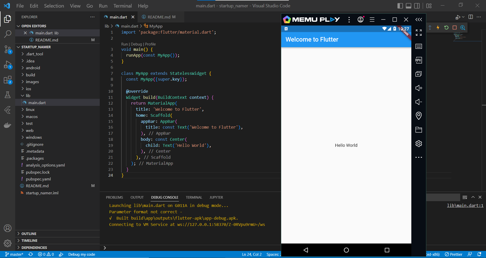
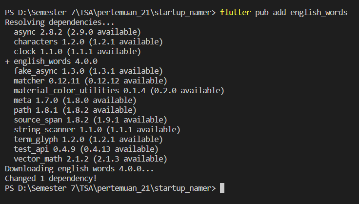
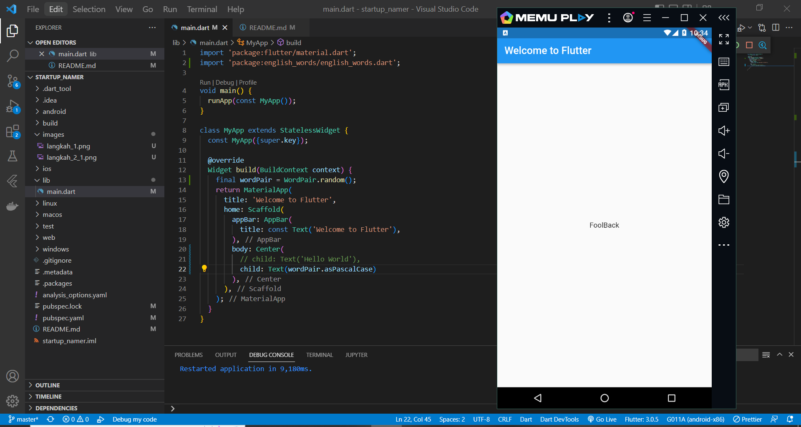
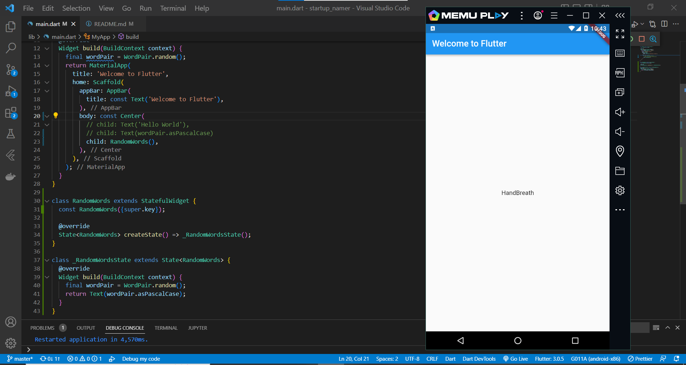
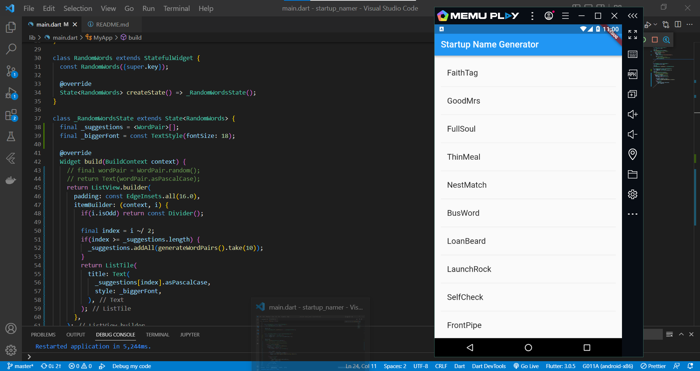

# startup_namer

Project pertemuan 21 TSA

## Create the starter flutter app

## Use an external package
1. install external package (english_words)

2. import the new package and change main.dart

## Add a stateful widget 

## Create an infinite scrolling ListView
